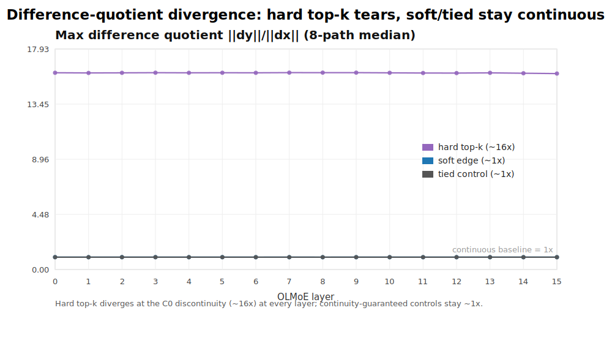

# How Torn Is a Trained Mixture-of-Experts?

**A Geometric Diagnostic for Routing Discontinuity in Released Weights**

This repository accompanies the paper ([`paper.pdf`](paper.pdf)). It contains the diagnostic
code and the result data behind every figure, so the figures can be regenerated **without a GPU**.



## What the paper measures

MoE layers route each token through a discrete top-k choice, making the layer-to-layer transport
map C⁰-discontinuous: a small nudge across a routing boundary can flip a token's experts and jump
the block output by an O(1) amount — a *tear*. We give a geometric diagnostic for this tear on
**released** MoE weights (OLMoE-1B-7B, Qwen1.5-MoE-A2.7B):

- a **difference-quotient continuity signature** whose divergence rate certifies the *order* of the
  singularity (order-0 jump: exponent ≈1, vs. continuity-guaranteed controls flat at ≈0);
- a **k/(k+1) expert cliff** with a cosine decomposition;
- a **distance-to-tear** and a **directional perturbation** test — random perturbations are blind to
  the tear, but boundary-normal perturbations of <1% relative magnitude flip experts and produce an
  output jump of ≈24% of the block-output norm.

The tear is real, large as a geometric per-block jump, and layer-consistent across the tested
layers of both released families; it is a *directional* inference liability, and at training time
it *decomposes* rather than detonates. See
[`paper.pdf`](paper.pdf) for the full account.

## Repository layout

```
paper.pdf                 the paper
moe_tear_probe.py         static diagnostic on released MoE weights
moe_train_probe.py        from-scratch GPT-MoE training probe
scripts/plot_results.py   dependency-free SVG figure generator (reads the JSONs)
figures/                  the 9 paper figures (SVG)
*.json                    result data behind every figure
```

## Reproduce the figures (no GPU, no dependencies)

```bash
python3 scripts/plot_results.py
```

Regenerates all 9 SVGs in `figures/` from the result JSONs. `plot_results.py` is standard-library only.

## Re-run the diagnostic

Running the probes on the real models needs a GPU and the published weights:

```bash
pip install -r requirements.txt

# static tear sweep on released OLMoE
python3 moe_tear_probe.py --sweep       --model allenai/OLMoE-1B-7B-0924 --device cuda
python3 moe_tear_probe.py --geom        --model allenai/OLMoE-1B-7B-0924 --device cuda
python3 moe_tear_probe.py --clamp-sweep --model allenai/OLMoE-1B-7B-0924 --device cuda
python3 moe_tear_probe.py --section6    --model allenai/OLMoE-1B-7B-0924 --device cuda --tau 0.02
```

Known-answer self-tests run with **no model download**:

```bash
python3 moe_tear_probe.py --selftest
python3 moe_tear_probe.py --geom-selftest
python3 moe_tear_probe.py --clamp-selftest
```

## Citation

```bibtex
@misc{zhang2026moetearing,
  title  = {How Torn Is a Trained Mixture-of-Experts? A Geometric Diagnostic
            for Routing Discontinuity in Released Weights},
  author = {Zhang, Zhuo},
  year   = {2026}
}
```

(arXiv link to follow.)

## License

Code is released under the MIT License ([`LICENSE`](LICENSE)). The paper (`paper.pdf`) is
© 2026 Zhuo Zhang, all rights reserved.
